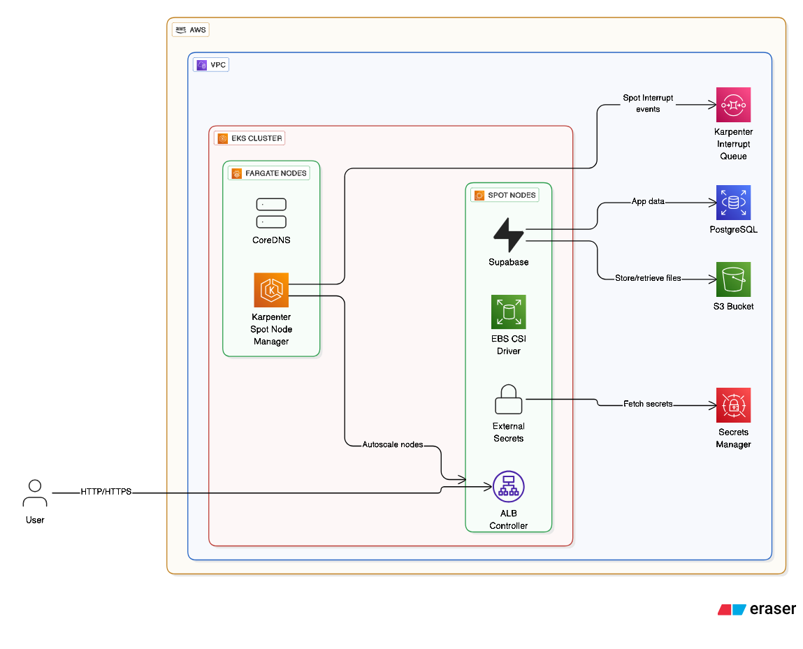

# Kube-Supabase

This repository contains the infrastructure as code for deploying a **Supabase** cluster on **Amazon Web Services (AWS)** using **Kubernetes**. The primary goal is to provide a robust, scalable, secure and reproducible **Supabase** environment.

AWS                   |  Kubernetes              |  Supabase
:-------------------------:|:------------------------:|:-------------------------:
  |    |  

-----

### Architecture Overview

The project's architecture is visually represented in the following diagram. For a more detailed breakdown, please refer to the [Architecture](docs/Architecture.md) documentation page.



-----

### Infrastructure Provisioning with Terraform

**Terraform** is the core tool used to provision and manage the foundational cloud infrastructure. This approach offers transparent control and direct manipulation of resources. The following key components are provisioned using Terraform:

  * **Virtual Private Cloud (VPC)**: The isolated network environment for all resources.
  * **Elastic Kubernetes Service (EKS) Cluster**: The managed Kubernetes service that hosts the Supabase stack.
  * **Relational Database Service (RDS) Database**: The primary database backend for Supabase.
  * **Simple Storage Service (S3) Object Store**: Used for storing application assets and data.

### Terraform over cdktf

We've chosen to use **HashiCorp Configuration Language (HCL)** over **Cloud Development Kit for Terraform (cdktf)** for the following reasons:

  * **Reduced Abstraction**: HCL provides a direct, transparent view of the infrastructure being created, eliminating the additional abstraction layer introduced by transpiling to languages like Python or TypeScript.
  * **Direct Control**: Writing in HCL gives us full, granular control over resource creation and configuration, which is crucial for infrastructure management.

-----

### Supabase Deployment with Helm

Once the EKS cluster is provisioned, **Helm** is used to deploy the Supabase microservices. We use a custom Helm chart based on the [supabase-kubernetes](https://github.com/supabase-community/supabase-kubernetes) community chart, with specific customizations tailored to our use case.

The following **Supabase** microservices are deployed:

  * `Auth`: User authentication service.
  * `Kong`: API Gateway for routing requests.
  * `Rest`: RESTful API for database access.
  * `Meta`: Metadata management.
  * `Storage`: File and object storage.
  * `Studio`: The Supabase web-based dashboard.

-----

### Getting Started

#### Prerequisites

Before you begin, ensure you have all the necessary prerequisites installed by running the following command:

```shell
./config.sh prerequisites
```

Learn more about the `config.sh` utility script on the [Config Script](https://www.google.com/search?q=docs/ConfigScript.md) documentation page.

#### Infrastructure Provisioning

To provision the infrastructure using Terraform, execute the following command:

```shell
./config.sh provision
```

#### Deployment Instructions

To deploy the Supabase services using Helm, run the following command:

```shell
./config.sh deploy
```

#### Tear-down Instructions

To destroy all provisioned cloud resources, use the tear-down command:

```shell
./config.sh tear-down
```

-----

### Project Documentation
  * **RDS Postgres**: A specific documentation on Postgres database operations is available on [RDSPostgres](docs/RDSPostgres.md)
  * **Config Script Guidelines**: A detailed reference of `config.sh` helper script is available on [ConfigScript](docs/ConfigScript.md)
  * **Security Considerations**: A detailed overview of the security measures implemented is available on the [Security](docs/Security.md) documentation page.
  * **Challenges & Learnings**: Read about the challenges we faced and the key learnings from this project on the [Challenges](docs/Challenges.md) documentation page.
  * **Real Deployment Screenshots**: A specific page with screenshots is available on [Screenshots](docs/Screenshots.md)

-----

### Future Improvements

We have identified several areas for future enhancements to improve the infrastructure's resilience, security, and automation.

#### Config Script

- Add argument validation and usage help menu (--help) to guide users through available commands and expected inputs.

- Introduce environment selection via flags (e.g., ./config.sh --env staging apply) instead of hardcoding DEFAULT_ENV="production".

- Add retry logic and error handling wrappers for critical commands (Terraform, Helm, kubectl) to reduce transient failure impact.

- Support parallel provisioning for independent Terraform modules (e.g., VPC + secret store), reducing deployment time.

#### Terraform Code

  * **General**:
      * Implement **S3 backend** for storing Terraform state, improving collaboration and state management. (`terraform/modules/bootstrap` folder)
      * Enhance module parametrization for greater flexibility.
      * Implement automated tagging standards across all resources for cost allocation and governance.

  * **RDS**:
      * Transition to a **Multi-AZ cluster** for high availability.
      * Enable **TLS/SSL** for encrypted database connections.
      * Configure **Encryption at Rest** for data security.
      * Enable **Performance Insights** for better database monitoring.
      * Add automated backup retention policies and cross-region read replicas for disaster recovery.

  * **S3**:
      * Configure lifecycle policies for S3 buckets to transition to Glacier for cost efficiency.
      * Enable S3 Access Logs and CloudTrail Data Events for security auditing.
      * Add replication between buckets for resilience and compliance.

  * **EKS**:
      * Enable **Network Policies** for inter-cluster traffic management.
      * Implement **Kyverno** for Kubernetes policy enforcement.
      * Integrate **AWS Route53** for improved ingress management with **public FQDN** and DNS management with `external-dns`.

  * **IAM & Security**:
      * Enforce IAM least-privilege policies with Access Analyzer and regular audits.
      * Use IAM Identity Center (SSO) for centralized identity management.
      * Enable rotation policies for IAM access keys and Secrets Manager entries.

#### Kubernetes Manifests

  * Migrate from raw Helm deployments to an automated **ArgoCD Sync** workflow for Continuous Deployment.

#### Supabase Application

  * Learn more about Supabase
  * Make it fully work with all possible microservices enabled
