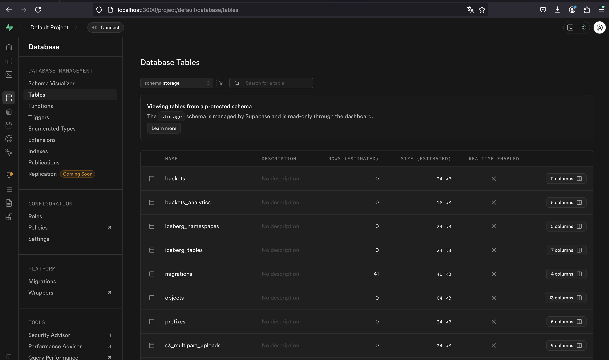
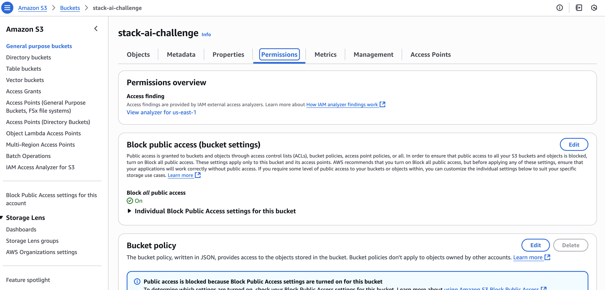
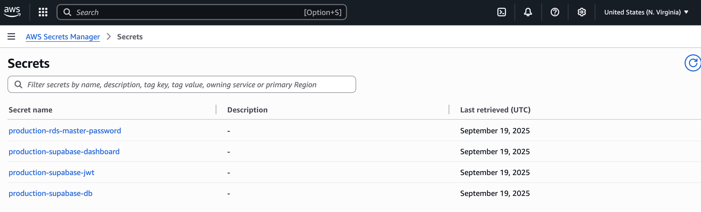

# Screenshots

Since the project is still in progress, here are some screenshots.

## Smoke Test

Test with `curl` to  `/rest/v1/` endpoint with `200 OK` response

## Kubernetes Cluster

Kubernetes pods visualised in `k9s` TUI

## Supabase Studio

Supabase Studio WebUI on web browser.

## Observability Stack

Dashboards and alerts for logs and metrics provided by the observability stack (VictoriaMetrics, Grafana, Loki)

## RDS Postgres

## S3 Object Store

## IAM Roles

## Secrets Manager

## EKS Access

## VPC Layout

